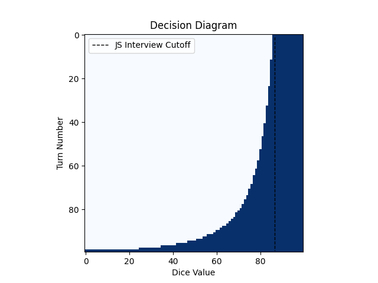
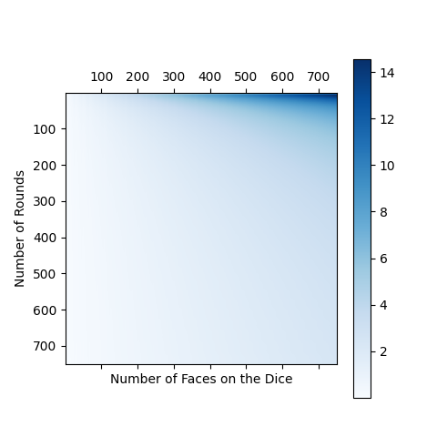
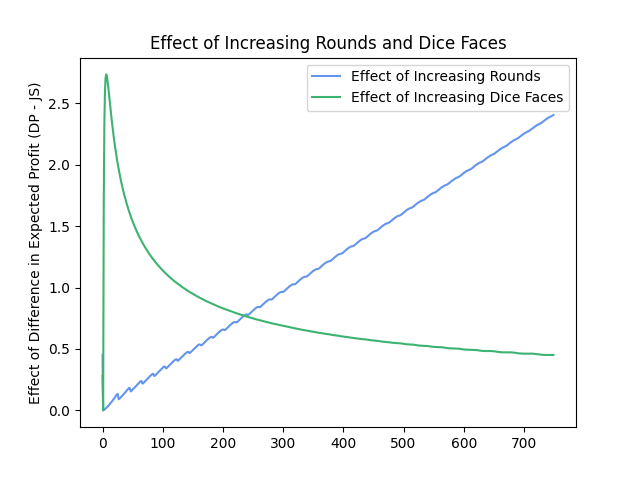
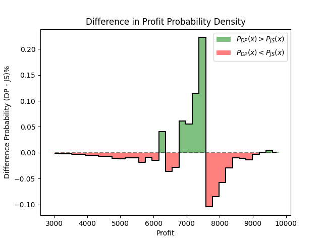

## Optimal Strategy for the JS Interview

### Intro

Recently, while scrolling youtube, I came across [a youtube video](https://www.youtube.com/watch?v=NT_I1MjckaU) which showed a mock Jane Street (JS) interview. Jane Street is a prestigious trading company and is well known to hire elite math and computer science students out of college. This theoretically makes sense since trading requires a good understanding of statistics, game theory and other math fields, as well as, the application of those fields. Personally, I have been long interested in algo-trading since it is both (possibly) a profitable and practical application of ML/RL/and other fields I'm interested in. Notably, the first question in the interview was incredibly tempting (simple enough to be solvable, but complicated enough that the solution is not trivial).

### Problem Setup

    The question goes as follows: you have a casino style game, which has some number of rounds, $N$. Each round you can choose to either re-roll the die or take the current value of the dice as profit. The die, like in most probability problems, when rolled, yields a uniformly distributed integer from the interval $[1, D]$, where $D$ is the number of faces on the die.  The die starts on a one.

### Interviewee Solution

    The solution given by the interviewee is as follows, we know that if we roll the number $D$, we should stop rolling and take money for the rest of the rounds (since this is the maximum possible amount each round). The first strategy she considers is rolling until the die obtains a value of $D$, the expected profit of this strategy is $D\cdot(N-D)$ since the number of rolls to obtain $D$, is the expectation of a geometric RV with $p=\frac{1}{D}$, and we have $N-D$ turns to collect money. Then she considers what we'll call a "top-k", strategy, where we keep rolling until we get some number in the interval $(D-k,D]$, so $k=1$, would be equivalent to the previous case. We can also calculate the expected profit using any value of $k$, which turns out to be: $(N-\frac{D}{k})(\frac{2D-k-1}{2})$, which is the product of the expectations of the number of rolls to reach a number in the interval (a geometric RV with $p=\frac{k}{D}$), and the expectation of the numbers once we stop (a discrete uniform distribution on $(D-k, D]$), these are independent so multiplying the expectations gives a valid result. Finally, she picks a $k$ which maximizes the expecation given the problem definition (the original problem included values for $N$, and $D$). *Technically if $k=D$, we should replace the $(N-\frac{D}{k})$ with $N$ since no additional rolls are required to get a one.*

    When I saw this solution, I was genuinely surprised! It seemed like an incredibly simple approach to the problem. However, I initially didn’t understand why the solution didn't depend on time. My intuition said you should be less picky during later stages of the game (you eventually want to take some profit rather than using more turns to re-roll). The key is that it actually does, though her solution is a good approximation for long games.

### Optimal DP Solution

    In the quest of getting richer, I decided to implement a algorithm that solves this game. I used a DP style algorithm with and $N$ by $D$ DP matrix. Each column, $d$, denotes the current face of the die and the row, $n$, determines the current round of the game, and the value of each cell is the remaining expected profit if we start on round $n$, with the die having value $d$. A key insight is that for the last round (also the last row of the DP matrix) we should always take profit and not re-roll, since we get 0 profit for rolling the die but a number greater than zero for taking the current value. Using this logic we can fill out the last row of the DP table, as $OPT(N, d) = d$ (since for the last timestep the profit remaining is just the current value of the die). Then we know that the row above we can either take the current value of the die and gain the profit in the same column for the next timestep (the expected profit from keeping the current die value), or we can reroll and gain zero this turn, but gain the mean value of the row below (the mean since we are equally likely to fall in any of these states when the die is rolled). We make the best decision each step (by taking the maximum): $OPT(n,d)=\max\{d+OPT(n+1, d),0+\frac{1}{D}\sum\limits_{i=1}^{D}OPT(n+1, i)\}$. The final answer is calculated by taking the value at $n=1,d=1$, since we start at round one with the die displaying a 1. The final time complexity of the algorithm is $O(nd^2)$ and the space complexity is $O(nd)$. Here is the Python & Numpy implementation:

```python
# note this implementation is 0 indexed since that is easier in Python
def dp_ex_profit(n, d):
    # keep this around, since we will use this a bunch
    dice_values = np.arange(d, dtype=float) +1
    # this is the expected profit DP matrix
    payoffs = np.zeros((n, d), dtype=float)

    # for the last row, the optimal expected profits are the die values
    payoffs[n -1, :] = dice_values

    # fill in DP backwards towards timestep 0
    for idx in range(n -2, 0 -1, -1):
        # the roll value is zero this round and the mean of the future
        # values
        roll_value = 0 +payoffs[idx +1, :].mean()
        # the take value is the current die value plus the value of the
        # the future profit in one timestep at the same die value
        take_value = dice_values +payoffs[idx +1, :]

        # take the best one
        payoffs[idx, :] = np.maximum(take_value, roll_value)

    # the overall profit is the cell value at the begining timestep and
    # starting on the 1, which corresponds to the column index being 0
    return payoffs[0, 0]
```

The JaneStreet algorithm can be implemented as follows:

```python
def js_ex_profit(n, d):
    # expected profit given top-k value k
    ex_p = lambda k: ((n -(d/k)) * (d*2 -k +1)/2)
    # build the profits array (technically we know this function
    # has only one critical point so once the sign of the derivative
    # changes, we could stop)
    cutoff_profs = [ex_p(k) for k in range(1, d +1)]

    # return the maximum profit (picks best profit we can make by
    # manipulating k).
    return np.max(cutoff_profs)
```

### Results

First we compare the decisions made by the interviewee solution and the DP solution:

The intuition should be that for large values of $N$, the decisions diverge.



This is exactly what we see, in fact, the Jane Street approach acts as if we were always playing early rounds, while the DP solution becomes more tolerant of bad dice closer to the end.


We can then also look at how the expected values between the algorithms change with respect to number of faces on the dice and number of rounds:



(the plot was smoothed with a rank-1 approximaiton)

As expected, we can see that the worst case for the Jane Street algorithm is when the number of faces is large and the number of rounds is small!

We can further get a grasp of their individual effects by plotting them seperately:



The results further match what we would expect!

Next, we can run a numerical simulation of both algorithms and plot the difference in the profit histograms to get an idea of exactly how our algorithm beats out the Jane Street algorithm:



We can see that although the DP algorithm sacrifices some higher profit outcomes, it heavily concentrates to the right and gets rid of the low profit tail that the Jane Street algorithm has.


### Conclusion

Although intuition can be misleading, it still remains a powerful tool to help guide your understanding of certain problems. Also, reasoning about trivial boundary conditions (such as the last turn in our example) and working backwards is a good approach for tackling problems (especially if they have some sort of inductive structure).
